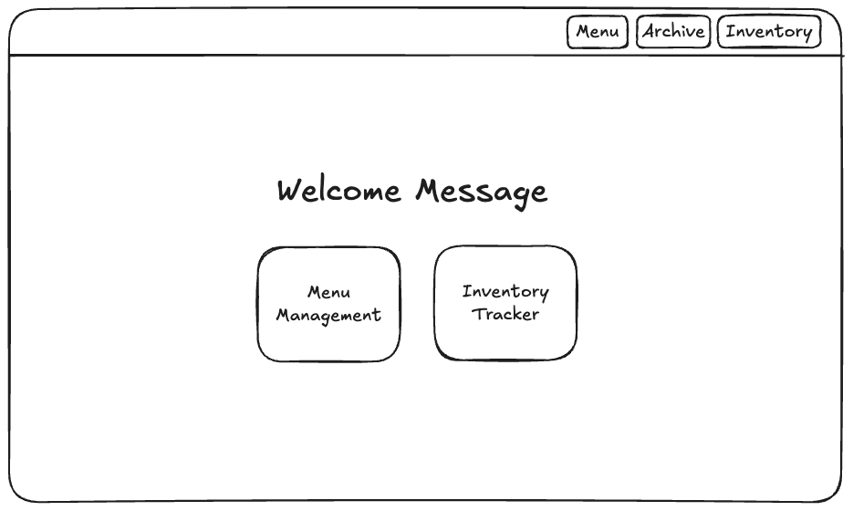
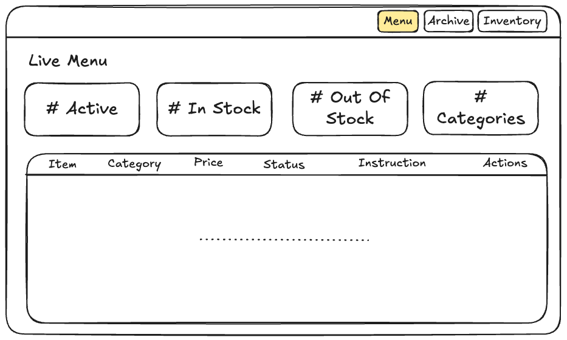
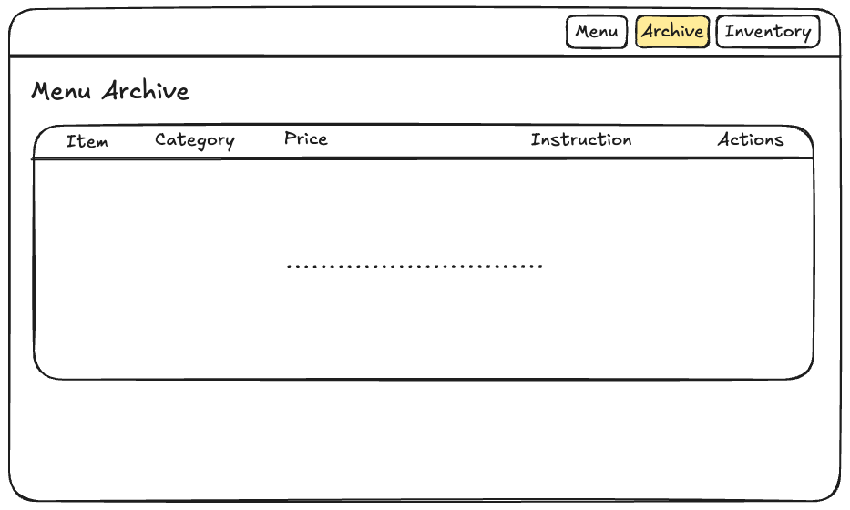
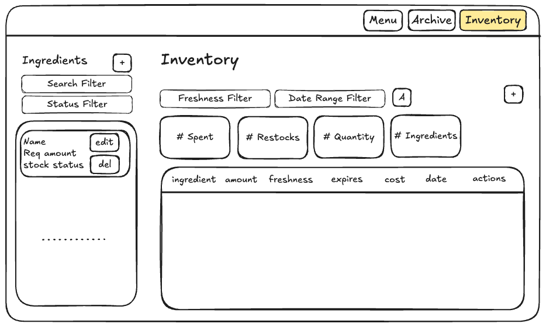

# Brew.Base — Design Document

## Project Description

Brew.Base is a web-based inventory management platform for small and medium-sized cafes. It digitizes two workflows: menu management (with soft-delete archiving) and inventory tracking (with cost/restock analytics). Built with Node.js, Express, MongoDB, Bootstrap 5, and vanilla JavaScript client-side rendering.

## User Personas

### Cafe Owner
- Goal: Wants to update menu prices instantly and analyze which ingredients are needed
- Pain Point: Currently uses a messy notebook; often forgets to restock milk or loses track of seasonal drink recipes

### Cafe Staff
- Goal: Needs to know exactly what is currently available to serve (Active Menu) and what is out of stock
- Pain Point: Often has to apologize to customers because an item on the physical menu is actually unavailable

## User Stories

### Menu Management

1. As a cafe owner, I want to add a new menu item with its name, price, category (e.g., Coffee, Pastry), and instructions, so I can expand my shop's offerings. (CREATE)
2. As a staff member, I want to view the "Live Menu" page that only displays items where `is_active = true`, so I know exactly what I can sell to customers right now. (READ)
3. As a staff member, I want to change a menu item's status to "Out of Stock" if the required ingredients are depleted, so customers aren't misled. (UPDATE)
4. As a cafe owner, I want to edit the price or description of an existing item to reflect changes without creating a new record. (UPDATE)
5. As a cafe owner, I want to remove an item from the live menu (e.g., seasonal watermelon coffee). (SOFT DELETE)
   - This action does not delete the data; it updates the database status to `is_active = false` and moves the item to the "Archive" page.
6. As a cafe owner, I want to access a separate "Menu Archive" page to view all disabled items. (READ)
7. As a cafe owner, I want to "Restore" an archived item, instantly moving it back to the live menu so I don't have to retype the information next season. (UPDATE)
8. As a cafe owner, I want to permanently delete an item from the Archive page to clean up the database of mistakes or test items. (HARD DELETE)

### Inventory Management

1. As a cafe owner, I want to keep track of my inventory stocks:
   - Log a new record when I restock a new ingredient, with the information of the item name, quantity, unit, expiration date, and total cost. (CREATE)
   - Check the amount of the ingredient and their status (in-stock, low-stock, out-of-stock). (READ)
   - Check the freshness of my ingredients (fresh, expiring soon, expired). (READ)
   - Adjust the information of an ingredient. (UPDATE)
   - Delete a record if I created it by mistake. (DELETE)
2. As a cafe owner, I want to analyze how much I spend and how often I restock on each ingredient within a specific date range. (READ)
3. As a staff member, I want to decrease the inventory amount when I open new ingredients to make drinks. (UPDATE)

## Design Mockups

### Home Page


### Live Menu


### Menu Archive


### Inventory


## Database Schema

### `menuItems` Collection

Stores menu items with soft-delete via `is_active` flag.

```json
{
  "_id": "ObjectId",
  "name": "Cappuccino",
  "price": 4.50,
  "category": "Coffee",
  "instructions": "How to prepare...",
  "is_active": true,
  "in_stock": true,
  "created_at": "ISODate",
  "updated_at": "ISODate"
}
```

- `is_active: false` = archived (soft-deleted)
- Categories: Coffee, Tea, Pastry, Smoothie, Seasonal, Other

### `ingredientItems` Collection

```json
{
  "_id": "ObjectId",
  "name": "Whole Milk",
  "required_amount": 20,
  "unit": "liters",
  "date_created": "ISODate",
  "date_modified": "ISODate"
}
```

- `required_amount` — the baseline amount needed; used to compute stock status
- Duplicate names are rejected (case-insensitive)

### `inventoryItems` Collection

Stores individual inventory batches — each restock event creates a new document.

```json
{
  "_id": "ObjectId",
  "ingredient_id": "ObjectId (references ingredientItems._id)",
  "initial_amount": 12,
  "current_amount": 6,
  "expiration_date": "ISODate",
  "total_cost": 48.00,
  "date_created": "ISODate",
  "date_modified": "ISODate",
  "date_finished": null
}
```

- `ingredient_id` — foreign key to `ingredientItems`
- `current_amount` — decreases as staff use the ingredient
- `date_finished` — set automatically when `current_amount` reaches 0
- Deleting an ingredient cascades to delete all its batches
- User needs to first create an ingredient item in order to log the inventory item of that ingredient. 


## Status Calculation Logic

### Stock Status (per ingredient)

Computed client-side by summing `current_amount` across all batches for an ingredient, compared against `required_amount`:

| Status | Condition |
|--------|-----------|
| Out of Stock | total `current_amount` = 0 |
| Low Stock | total `current_amount` < 20% of `required_amount` |
| In Stock | total `current_amount` ≥ 20% of `required_amount` |

### Freshness Status (per batch)

Computed client-side from `expiration_date` relative to today:

| Status | Condition |
|--------|-----------|
| Expired | expiration date is in the past |
| Expiring Soon | expiration date is within 5 days |
| Fresh | expiration date is more than 5 days away |

## Architecture Decisions

- **Singleton DB connection** — `connectDB()` runs once at startup, `getDB()` returns the shared connection. Closed only on `SIGINT`. Avoids per-request connection overhead.
- **Two collections for inventory** — Normalized design (`ingredientItems` + `inventoryItems`) rather than embedded batches. Enables clean `$lookup` joins, straightforward per-batch CRUD, and easy analytics aggregation.
- **Client-side status computation** — Stock status and freshness are calculated in the browser from fetched data rather than stored in the database. Avoids stale computed fields and keeps writes simple.
- **Client-side filtering and pagination** — All batches are fetched once, then filtered/paginated in JavaScript. Acceptable for the expected data volume of an SMB cafe (hundreds to low thousands of records).
- **No authentication** — Designed for single-cafe use on a trusted network. Auth can be added later as middleware.
