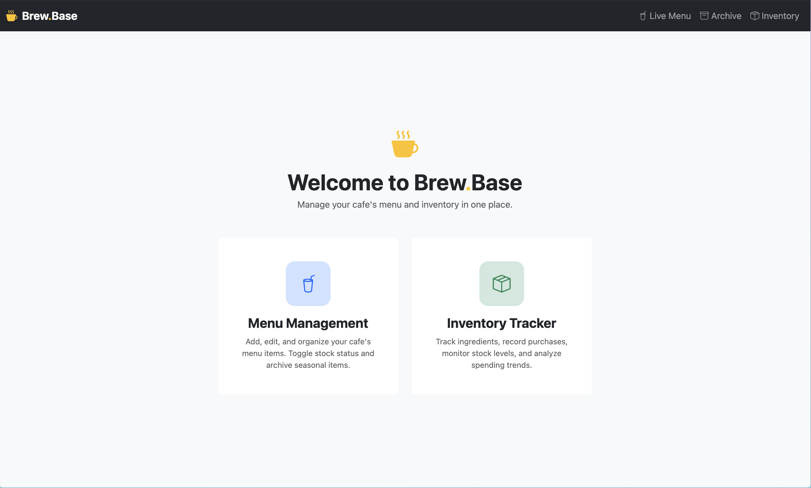
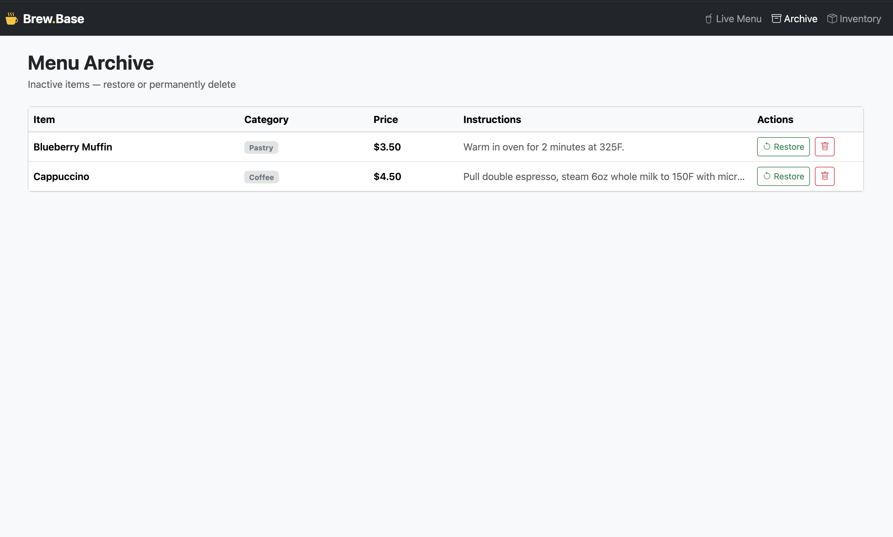
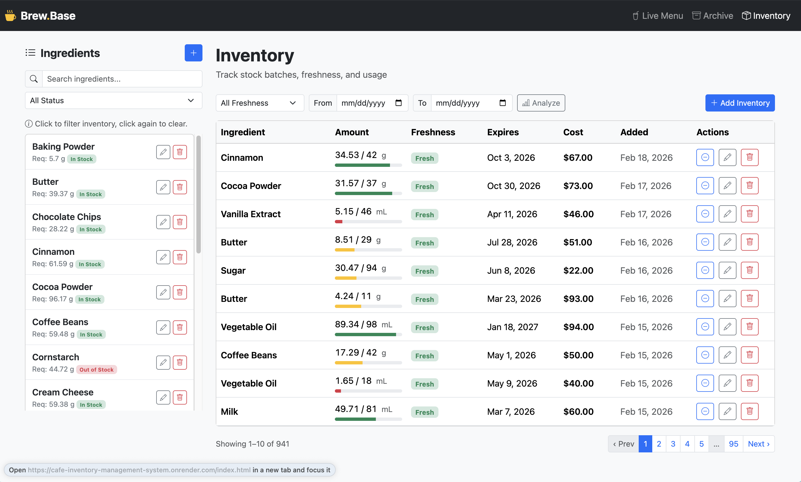

# ☕ Brew.Base — Cafe Inventory Management System

A full-stack web application that helps small and medium-sized cafe owners digitize and streamline the management of their menus and inventories.

**Live Demo:** [https://cafe-inventory-management-system.onrender.com](https://cafe-inventory-management-system.onrender.com)

<table>
  <tr>
    <td align="center"><strong>Home</strong><br></td>
    <td align="center"><strong>Live Menu</strong><br></td>
  </tr>
  <tr>
    <td align="center"><strong>Menu Archive</strong><br></td>
    <td align="center"><strong>Inventory</strong><br></td>
  </tr>
</table>

## Features

### Menu Management (Pangta Huang)

- **Live Menu** — View, add, edit, and manage active menu items
  - Search and filter by category
  - Sort by name, price, or category
  - Toggle between table and card views
  - Price range slider filter
  - Bulk select and batch operations (archive, mark in/out of stock)
  - Click any item for full detail view with preparation instructions
  - Real-time form validation with duplicate name detection
- **Menu Archive** — Soft-delete system for inactive items
  - Restore archived items back to the live menu
  - Permanently delete items that are no longer needed

### Inventory Management (Hsin-Yao Huang / Amy)

- **Ingredient Management** — Manage ingredient items (CRUD)
  - Search by ingredient name
  - Filter by stock status
  - Click ingredient to filter inventory list
- **Inventory Tracker** — Manage inventory items for each ingredients (CRUD)
  - Paginated list of inventory items sorted by creation date
  - Track the freshness and quantity of each inventory item
  - Filter by freshness and added date
- **Inventory Analytics** — Summary cards (total spent, restocks, quantity, ingredients) for the current filtered inventory view

## Tech Stack

| Layer          | Technology                                                           |
| -------------- | -------------------------------------------------------------------- |
| **Frontend**   | HTML5, Bootstrap 5, Bootstrap Icons, Vanilla JavaScript (ES Modules) |
| **Backend**    | Node.js, Express.js (ESM)                                            |
| **Database**   | MongoDB Atlas (cloud-hosted)                                         |
| **Deployment** | Render (Web Service)                                                 |

## Project Structure

```
├── public/
│   ├── index.html                  # Redirect to menu
│   ├── menu.html                   # Live Menu page
│   ├── menu-archive.html           # Menu Archive page
│   ├── inventory.html              # Inventory page (ingredients + batches + analytics)
│   ├── scripts/
│   │   ├── menu.js                 # Menu frontend logic
│   │   └── inventory.js            # Inventory frontend logic
│   └── styles/
│       ├── main.css                # Shared styles
│       ├── menu.css                # Menu-specific styles
│       └── inventory.css           # Inventory-specific styles
├── src/
│   ├── config/index.js             # App configuration
│   ├── db/connection.js            # MongoDB connection
│   ├── routes/
│   │   ├── menu.js                 # Menu API endpoints
│   │   └── inventory.js            # Inventory API endpoints
│   └── server.js                   # Express server entry point
├── package.json
└── .env                            # Environment variables (not committed)
```

## How To Build

### Prerequisites

- [Node.js](https://nodejs.org/) v18+
- [MongoDB Atlas](https://www.mongodb.com/atlas) account (free tier works)

### Installation

```bash
# Clone the repository
git clone https://github.com/willyhuang18/Cafe-Inventory-Management-System.git
cd Cafe-Inventory-Management-System

# Install dependencies
npm install

# Create environment file
cp .env.example .env
```

### Configure MongoDB

1. Go to [MongoDB Atlas](https://cloud.mongodb.com/)
2. Click **Connect** → **Drivers** → copy the connection string
3. Paste into `.env`:

```env
MONGODB_URI=mongodb+srv://<username>:<password>@<cluster>.mongodb.net/cafe_inventory?retryWrites=true&w=majority
PORT=3000
```

### Run Locally

```bash
npm start
```

Open [http://localhost:3000](http://localhost:3000) in your browser.

### Development Mode

```bash
npm run dev
```

Uses `nodemon` for auto-restart on file changes.

## API Endpoints

### Menu (`/api/menu`)

| Method | Endpoint                | Description                |
| ------ | ----------------------- | -------------------------- |
| GET    | `/api/menu`             | Get all active menu items  |
| GET    | `/api/menu/archive`     | Get all archived items     |
| GET    | `/api/menu/:id`         | Get single item by ID      |
| POST   | `/api/menu`             | Create new menu item       |
| PUT    | `/api/menu/:id`         | Update menu item           |
| PUT    | `/api/menu/:id/archive` | Archive (soft delete) item |
| PUT    | `/api/menu/:id/restore` | Restore archived item      |
| DELETE | `/api/menu/:id`         | Permanently delete item    |

### Inventory (`/api/inventory`)

| Method | Endpoint                         | Description                                    |
| ------ | -------------------------------- | ---------------------------------------------- |
| GET    | `/api/inventory`                 | Get all inventory batches with ingredient info |
| POST   | `/api/inventory`                 | Add new inventory batch                        |
| PUT    | `/api/inventory/:id`             | Update inventory batch                         |
| PATCH  | `/api/inventory/:id/use`         | Decrease quantity (staff use)                  |
| DELETE | `/api/inventory/:id`             | Delete inventory batch                         |
| GET    | `/api/inventory/ingredients`     | Get all ingredients                            |
| POST   | `/api/inventory/ingredients`     | Create new ingredient                          |
| PUT    | `/api/inventory/ingredients/:id` | Update ingredient                              |
| DELETE | `/api/inventory/ingredients/:id` | Delete ingredient and its batches              |

## Team

| Member                   | Responsibility                         |
| ------------------------ | -------------------------------------- |
| **Pangta Huang**         | Menu Management, Analytics, Deployment |
| **Hsin-Yao Huang (Amy)** | Inventory Management                   |

## License

MIT
